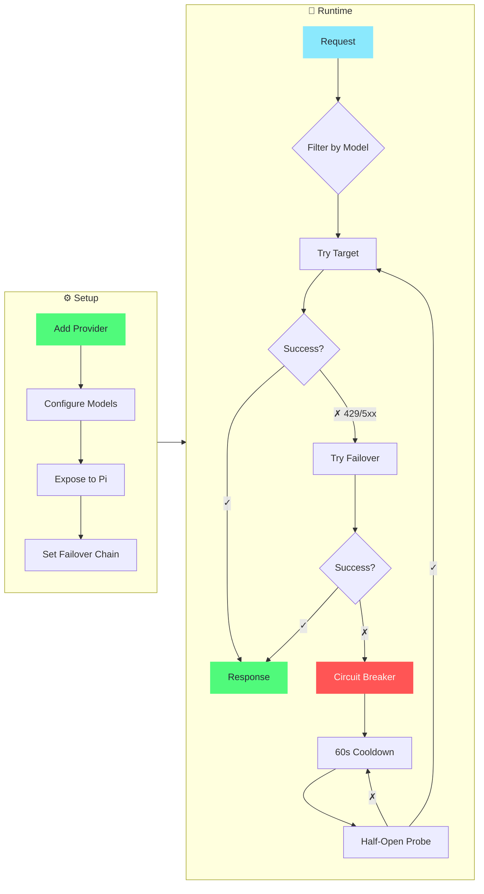

<div align="center">

# pi-switch

[](https://github.com/user/pi-switch/releases)
[](https://github.com/user/pi-switch/releases)
[](https://www.rust-lang.org/)
[](LICENSE)

**TUI + CLI dual-mode profile switcher for pi agent**

Manage provider profiles, switch models.json, and run a local proxy with failover — via an interactive TUI or CLI.

[English](#) | [中文](README_ZH.md)

</div>

---

## 📸 Screenshots

<div align="center">
  
</div>

---

## 📥 Installation

```bash
# npm (recommended)
npm install -g @cokefenta/pi-switch

# or via pi
pi install npm:@cokefenta/pi-switch
```

**Build from source** (requires Node.js >= 20, Rust 1.80+):

```bash
git clone https://github.com/user/pi-switch.git
cd pi-switch
npm install
npm run build:native
node bin/pi-switch.js tui
```

---

## 🚀 Quick Start

```bash
pi-switch tui          # Interactive TUI (recommended)
pi-switch doctor       # Run environment diagnostics
```

### Essential CLI Commands

```bash
# Provider management
pi-switch provider add <name> [--preset <id>] [--api-key <key>]
pi-switch provider list
pi-switch provider show <name>
pi-switch provider delete <name>
pi-switch provider expose <name> <model-ids...>    # Expose models to pi agent
pi-switch provider fetch-models <name>             # Fetch models from API

# Proxy
pi-switch proxy target <name>                      # Set proxy target
pi-switch proxy failover <p1,p2,...>               # Set failover chain
pi-switch proxy start --daemon                     # Start proxy daemon
pi-switch proxy status

# Other
pi-switch presets list                             # List built-in presets
pi-switch config show                               # Display current config
pi-switch config backups                            # List backup files
pi-switch config export <passphrase>                # Encrypted export
pi-switch config import <path> <passphrase>         # Encrypted import
pi-switch stats                                     # View request statistics
```

---

## ✨ Features

| Category | Highlights |
|----------|------------|
| 🔌 **Provider Management** | CRUD, duplicate, search/filter, model management, expose to pi agent |
| 💡 **Built-in Presets** | OpenRouter, Anthropic, DeepSeek, SiliconFlow, OpenAI — add profiles instantly |
| 🌉 **Local Proxy** | OpenAI-compatible, transparent routing, Anthropic auto-conversion, failover, circuit breaker |
| 🖥️ **Interactive TUI** | ratatui-powered, Dracula theme, mouse support, vim keys (`hjkl`) |
| 🌐 **Bilingual** | English / 中文, persisted to config, toggle in Settings |
| 📊 **Usage Stats** | Per-provider, per-model request metrics & latency |
| 💾 **Backup & Sync** | Auto-backup on mutation, AES-256-CBC encrypted export/import |
| 🩺 **Diagnostics** | `doctor` command checks config, models.json, structure |

---

## 🎯 Core Workflow

### Provider Management & Intelligent Failover



### Step by Step

**1. Add a provider** (CLI or TUI)  
```bash
pi-switch provider add relay-a --api openai --base-url https://relay.example.com/v1 \
    --api-key '$API_KEY' --models deepseek-v4-pro,deepseek-chat
```
In TUI: `Profiles → a → fill form → Ctrl+S`

**2. Expose models to pi agent** — choose which models appear in `~/.pi/agent/models.json`  
```bash
pi-switch provider expose relay-a deepseek-v4-pro
```
In TUI: `Profiles → select provider → x`

**3. Set up proxy failover** — define primary target + fallback chain  
```bash
pi-switch proxy target deepseek-official
pi-switch proxy failover relay-a,relay-b
pi-switch proxy start --daemon
```

**4. Use it in pi** — models routed through proxy now appear in pi's `/model`

### How Failover Works

Requests are intelligently routed by model availability:
- **Smart routing** — only tries providers that support the requested model
- **Automatic failover** — switches on 429/5xx errors or network failures
- **Circuit breaker** — after 3 consecutive failures, provider enters 60s cooldown; auto-recovery on half-open probe success
- **Model isolation** — `exposedModels` keeps pi config clean while `models` enables full failover

---

## 🏗️ Architecture

```
pi-switch/
├── bin/pi-switch.js         # CLI entry point
├── index.js                 # ESM wrapper for native addon
├── pi-switch-native.cjs     # NAPI loader (auto platform detection)
├── src-rust/                # Rust native core (napi-rs)
│   ├── lib.rs               # NAPI function exports
│   ├── config.rs            # Config load/save, types
│   ├── ops.rs               # Core operations
│   ├── presets.rs           # Built-in provider presets
│   ├── proxy.rs             # Proxy server (failover, circuit breaker)
│   ├── daemon.rs            # Daemon lifecycle
│   ├── stats.rs             # Request log aggregation
│   ├── sync.rs              # Encrypted export/import
│   └── tui/                 # Interactive terminal UI (ratatui)
│       ├── app.rs           # State machine + key handler
│       ├── form.rs          # Provider form state
│       ├── i18n.rs          # Bilingual (EN/ZH)
│       └── ui/              # Rendering (chrome, pages, overlays)
├── src/                     # JavaScript layer
│   ├── commands.js          # CLI commands
│   ├── proxy.js             # JS proxy server
│   └── tui.js               # JS TUI wrapper
├── extensions/index.ts      # Pi agent extension (/piswitch)
└── Cargo.toml
```

**Config files:**
- `~/.pi-switch/config.json` — profiles, proxy settings, current selection
- `~/.pi-switch/backups/` — timestamped auto-backups on every mutation
- `~/.pi/agent/models.json` — pi's provider registry (written by pi-switch)

---

## ❓ FAQ

<details>
<summary><b>How do I switch pi to a different provider?</b></summary>
<br>

```bash
pi-switch use <name>
```
Or in TUI: navigate to Profiles, press `Space` on any profile.

</details>

<details>
<summary><b>How do I set up failover?</b></summary>
<br>

In TUI: `Settings → Failover chain → Enter` → enter comma-separated names → `Enter`.
Or directly edit `~/.pi-switch/config.json` under `settings.proxy.failover`.

</details>

<details>
<summary><b>What does the [proxy] badge mean?</b></summary>

<br>

The `[proxy]` badge indicates this profile is configured to route through the local transparent proxy. When a profile is set as the proxy target, its baseUrl automatically points to the proxy server (e.g., `http://127.0.0.1:8190`), and all requests are transparently routed with automatic failover and circuit breaker protection.

To use the proxy:
1. Set a target profile: `pi-switch proxy target <name>`
2. Configure failover chain: `pi-switch proxy failover <p1,p2,...>`
3. Start the proxy: `pi-switch proxy start --daemon`
4. Add the proxy profile to pi: `pi-switch provider add proxy --preset proxy`

</details>

<details>
<summary><b>How does transparent proxy routing work?</b></summary>

<br>

When you set a profile as the proxy target, its `baseUrl` is automatically rewritten to point to the local proxy server. Pi's requests are transparently routed through the proxy with intelligent failover:

```bash
# 1. Set proxy target
pi-switch proxy target deepseek-official

# 2. Set failover chain (optional)
pi-switch proxy failover relay-a,relay-b

# 3. Start proxy daemon
pi-switch proxy start --daemon
```

Now when pi uses the `deepseek-official` configuration, all requests automatically go through the proxy with smart failover to `relay-a` → `relay-b` on 429/5xx errors.

The proxy routes by model availability — only providers with the requested model in their `models` list are tried.

</details>

<details>
<summary><b>Where is my data stored?</b></summary>
<br>

Everything under `~/.pi-switch/`. Pi's own registry is `~/.pi/agent/models.json`. No data leaves your machine.

</details>

---

## 🛠️ Development

```bash
npm run build:native:debug     # Build Rust addon (debug)
npm run build:native           # Build Rust addon (release)
cargo build                    # Rust-only build
cargo clippy                   # Lint
cargo fmt                      # Format
```

---

## 🙏 Acknowledgments

- **[cc-switch](https://github.com/farion1231/cc-switch)** — the original TUI-based profile switcher for Claude Code, which pioneered the interactive terminal UI pattern and proxy failover design
- **[cc-switch-cli](https://github.com/SaladDay/cc-switch-cli)** — the CLI counterpart, providing a clean command-line interface for provider management

Thanks also to the **[LINUX DO](https://linux.do/)** community for the discussions that sparked this project.

---

## 📜 License

MIT
