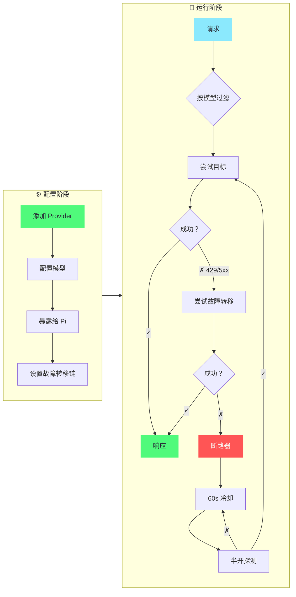

<div align="center">

# pi-switch

[](https://github.com/user/pi-switch/releases)
[](https://github.com/user/pi-switch/releases)
[](https://www.rust-lang.org/)
[](LICENSE)

**TUI + CLI 双模式的 pi agent 配置切换工具**

管理 provider 配置，切换 models.json，运行本地代理与故障转移。交互式 TUI，支持完整 CRUD，Dracula 主题，双语支持。

[English](README.md) | [中文](#)

</div>

---

## 📖 关于

pi-switch 是 [pi coding agent](https://pi.dev) 的轻量级配置切换工具。它管理 `~/.pi/agent/models.json` 中的 provider 配置——通过 CLI 或交互式终端界面添加、编辑、删除和切换配置。

使用 Rust (napi-rs) 构建为原生 Node.js 扩展。交互式 TUI 参考 cc-switch 设计。

---

## 📸 截图

<div align="center">
  
</div>

## 🚀 快速开始

**TUI 模式（推荐）**
```bash
pi-switch tui
```
使用全屏界面管理 providers、浏览预设、查看代理状态、配置设置。

**命令行模式**
```bash
pi-switch provider list              # 列出所有 provider 配置
pi-switch provider add <名称> [--preset <id>] [--api-key <key>]  # 添加配置
pi-switch use <名称>                 # 切换 pi 到此配置
pi-switch provider show <名称>       # 显示配置详情
pi-switch provider delete <名称>     # 删除配置
pi-switch presets list               # 列出内置 provider 预设
pi-switch config show                # 显示当前配置
pi-switch config backups             # 列出备份文件
pi-switch stats                      # 查看代理请求统计
pi-switch doctor                     # 运行环境诊断
```

---

## 🎯 核心流程

### Provider 管理与智能故障转移



#### 流程步骤

pi-switch 提供完整的 provider 管理和智能模型故障转移工作流：

#### 1️⃣ 添加 Provider（手动输入模型）

添加带手动指定模型的 provider：

```bash
# CLI
pi-switch provider add relay-a --api openai --base-url https://relay.example.com/v1 --api-key '$API_KEY' --models deepseek-v4-pro,deepseek-chat

# TUI
Profiles → 'a' → 填写表单 → models: "deepseek-v4-pro, deepseek-chat" → Ctrl+S
```

**结果：** 创建带 `models` 列表的 provider。

#### 2️⃣ 抓取并选择模型（可选）

自动从 provider 抓取所有可用模型：

```bash
# 仅 TUI（即将支持）
Profiles → 选择 provider → 'f'（抓取模型）
```

系统会：
- 调用 provider 的 `/models` API
- 显示带预选现有模型的清单
- 允许你添加/删除模型
- 保存更新的 `models` 列表

**目的：** `models` 定义此 provider **支持**的模型（用于故障转移路由）。

#### 3️⃣ 暴露模型到 Pi 配置

选择要暴露到 `~/.pi/agent/models.json` 的模型：

```bash
# 仅 TUI（即将支持）
Profiles → 选择 provider → 'x'（暴露模型）
```

勾选你想让 pi agent 看到的模型：
```
Provider: relay-a
可用模型：
  [√] deepseek-v4-pro      ← 暴露
  [ ] deepseek-chat        ← 不暴露
  [√] deepseek-v4-flash    ← 暴露
```

**结果：** 只有勾选的模型会写入 `~/.pi/agent/models.json`。

**目的：** `exposedModels` 控制哪些模型**出现在 pi agent** 中（防止配置臃肿）。

#### 4️⃣ 配置故障转移优先级

在设置中配置故障转移链：

```bash
# TUI
Settings → Target: deepseek-official
Settings → Failover: relay-a, relay-b
```

**结果：** 请求优先级顺序：`deepseek-official` → `relay-a` → `relay-b`

#### 5️⃣ 智能基于模型的故障转移

当请求到达时，代理根据模型可用性智能路由：

```
用户请求：deepseek-v4-pro
↓
1. 按模型支持过滤候选
   检查每个 provider 的 `models` 列表：
   - deepseek-official.models: ["deepseek-v4-pro", ...] ✓
   - relay-a.models: ["deepseek-v4-pro", "deepseek-chat"] ✓
   - relay-b.models: ["deepseek-chat"] ✗（无匹配，跳过）

2. 按优先级顺序尝试候选
   - 尝试 deepseek-official → 429 频率限制 → 记录失败
   - 尝试 relay-a → 成功 ✓

3. 断路器保护
   - 连续 3 次失败后，provider 进入冷却
   - 冷却后半开状态允许单次探测
   - 探测成功时自动恢复
```

**关键优势：**
- **智能路由**：只尝试有请求模型的 providers
- **自动故障转移**：在 429/5xx 错误或网络故障时无缝切换
- **断路器**：防止级联故障，自动恢复
- **模型隔离**：`exposedModels` 保持 pi 配置简洁，`models` 启用完整故障转移

**故障转移触发条件：**
- HTTP 429（频率限制）、500、502、503、504
- 网络错误（超时、连接失败）
- 断路器打开（3+ 次失败，60s 冷却）

**非故障转移情况：**
- 4xx 客户端错误（400、401、403、404）→ 直接返回
- 2xx 成功 → 直接返回

---

## 📥 安装

### npm（推荐）

```bash
npm install -g cokefenta@pi-switch
```

### Pi 包

```bash
pi install npm:cokefenta@pi-switch
```

### 从源码构建

**前置要求：**
- Node.js >= 20
- Rust 1.80+ ([通过 rustup 安装](https://rustup.rs/))

**构建：**
```bash
git clone https://github.com/user/pi-switch.git
cd pi-switch
npm install
npm run build:native
node bin/pi-switch.js tui
```

---

## ✨ 功能特性

### 🔌 Provider 管理

管理 pi agent 的 provider 配置。内置预设：OpenRouter、Anthropic、DeepSeek、SiliconFlow、OpenAI。

**功能：** 添加、编辑、删除、复制、当前标记、代理徽章、provider ID 显示、搜索/过滤。

```bash
pi-switch provider list              # 列出所有 provider 配置
pi-switch provider show <名称>       # 显示配置详情
pi-switch provider add <名称> [--preset <预设>]
pi-switch provider delete <名称>     # 删除配置
pi-switch provider duplicate <名称> [--as <新名称>]
pi-switch use <名称> [--mode merge|exclusive]  # 切换 pi 到配置
```

### 💡 内置预设

预配置 API 端点和模型的即用型 provider 模板。

```bash
pi-switch presets list               # 列出所有预设
pi-switch presets show <id>          # 显示预设详情
```

在 TUI 中：Presets → Enter 从预设模板创建配置。

### ⚙️ 配置管理

管理配置备份、导入和加密导出。

```bash
pi-switch config show                # 显示完整配置
pi-switch config path                # 显示配置文件路径
pi-switch config backups             # 列出备份文件
pi-switch config export <密码>       # 加密导出（AES-256-CBC）
pi-switch config import <路径> <密码>  # 加密导入
```

### 🌉 本地代理

OpenAI 兼容代理，自动 Anthropic 转换、故障转移链和断路器。

```bash
pi-switch proxy start  [--host <ip>] [--port <port>] [--profile <名称>]
pi-switch proxy stop
pi-switch proxy status
```

端点：
- `GET /health`
- `GET /v1/models`
- `POST /v1/chat/completions`（OpenAI → Anthropic 自动转换）
- `POST /v1/messages`（Anthropic 原生转发）

### 📊 使用统计

从代理日志聚合的请求指标。

```bash
pi-switch stats
```

显示：总请求数、成功率、按 provider 分解、按模型分解、平均延迟。

### 🩺 诊断

```bash
pi-switch doctor
```

检查：配置文件存在、models.json 有效性、JSON 结构、配置数量、备份目录。

### 🌐 多语言支持

交互式 TUI 支持英语和中文。语言保存到配置。

- 默认语言：英语（设置 `PI_SWITCH_LANG=zh` 初始为中文）
- 在 TUI 中：⚙️ Settings → Language → `←→/Space` 切换

### 🖥️ 交互式 TUI

```bash
pi-switch tui
```

使用 ratatui 构建的完整交互式终端界面：

- **Profiles**：表格显示代理徽章、provider ID、当前标记，支持添加/编辑/删除/复制/切换/搜索
- **Presets**：浏览预设模板，从预设创建配置
- **Proxy**：启动/停止守护进程，查看目标/故障转移/监听信息状态
- **Stats**：按 provider 和模型的请求指标
- **Backups**：浏览配置备份历史
- **Settings**：语言（English / 中文）、代理 host/port/target/failover 编辑

按键绑定：
- `←→` 在菜单和内容间切换
- `↑↓ / j k` 移动选择
- `Enter` 打开详情/确认
- `?` 帮助覆盖层
- `/` 过滤
- `q` 退出

---

## 🏗️ 架构

### 核心设计

- **napi-rs 原生扩展**：Rust 核心编译为 `.node` 二进制供 Node.js 使用
- **pi-switch 配置**：`~/.pi-switch/config.json` 包含配置、代理设置、备份元数据
- **pi models.json**：`~/.pi/agent/models.json` — pi 读取的 provider 定义文件
- **原子写入**：临时文件 + 重命名模式防止损坏
- **备份轮换**：每次修改自动备份，存储在 `~/.pi-switch/backups/`

### 配置文件

- `~/.pi-switch/config.json` — Profiles、当前选择、代理设置
- `~/.pi-switch/backups/` — 带时间戳的配置备份
- `~/.pi/agent/models.json` — pi agent provider 注册表（由 `pi-switch use` 写入）

### 代码结构

```
pi-switch/
├── bin/pi-switch.js         # CLI 入口
├── index.js                 # NAPI 重导出
├── pi-switch-native.cjs     # NAPI 加载器（自动平台检测）
├── src-rust/
│   ├── lib.rs               # NAPI 函数导出
│   ├── config.rs            # 配置加载/保存、类型
│   ├── ops.rs               # 核心操作（use/upsert/remove/duplicate）
│   ├── presets.rs           # 内置 provider 预设
│   ├── daemon.rs            # 代理守护进程管理
│   ├── stats.rs             # 请求日志聚合
│   └── tui/                 # 交互式终端界面
│       ├── app.rs           # 状态机 + 按键处理
│       ├── form.rs          # Provider 表单状态
│       ├── text_edit.rs     # Readline 风格文本输入
│       ├── theme.rs         # Dracula 主题 + 颜色降级
│       ├── route.rs         # 导航路由
│       ├── i18n.rs          # 双语文本（English / 中文）
│       └── ui/              # 渲染（chrome/pages/profiles/overlay）
├── package.json
└── Cargo.toml
```

---

## ❓ 常见问题

<details>
<summary><b>如何切换 pi 到不同的 provider？</b></summary>

<br>

```bash
pi-switch use <名称>
```

这会更新 `~/.pi/agent/models.json`，让 pi 使用新的 provider。如果 pi 已在运行，在 pi 中使用 `/model` 刷新。

或者：打开 TUI，导航到 Profiles，在任意配置上按 `Space`。

</details>

<details>
<summary><b>如何添加自定义 provider？</b></summary>

<br>

**CLI：**
```bash
pi-switch provider add my-provider --api openai-completions --base-url https://api.example.com/v1 --api-key '$MY_API_KEY' --model gpt-4
```

**TUI：** Profiles → `a` → 填写表单 → `Ctrl+S`

</details>

<details>
<summary><b>[proxy] 徽章是什么意思？</b></summary>

<br>

带 `[proxy]` 徽章的配置在其配置中有 `"proxy": true`。这意味着它配置为通过本地代理路由。代理可以在 OpenAI 和 Anthropic 格式间自动转换并应用故障转移/断路器策略。

</details>

<details>
<summary><b>如何设置故障转移？</b></summary>

<br>

在 TUI 中：⚙️ Settings → Failover chain → `Enter` → 输入逗号分隔的配置名称 → `Enter` 保存。

或直接在 `~/.pi-switch/config.json` 的 `settings.proxy.failover` 中配置。

</details>

<details>
<summary><b>我的数据存储在哪里？</b></summary>

<br>

所有 pi-switch 数据在 `~/.pi-switch/` 下。pi 自己的 provider 注册表是 `~/.pi/agent/models.json`。没有数据被发送到任何地方。

</details>

---

## 🛠️ 开发

### 要求

- **Node.js**: >= 20
- **Rust**: 1.80+ ([rustup](https://rustup.rs/))
- **npm**: Node.js 自带

### 命令

```bash
cd pi-switch

npm run build:native:debug      # 构建 Rust 原生扩展（debug）
npm run build:native            # 构建 Rust 原生扩展（release）
node bin/pi-switch.js tui       # 运行 TUI

cargo build                     # 仅 Rust 构建
cargo clippy                    # Lint
cargo fmt                       # 格式化
```

---

## 📜 许可证

MIT
