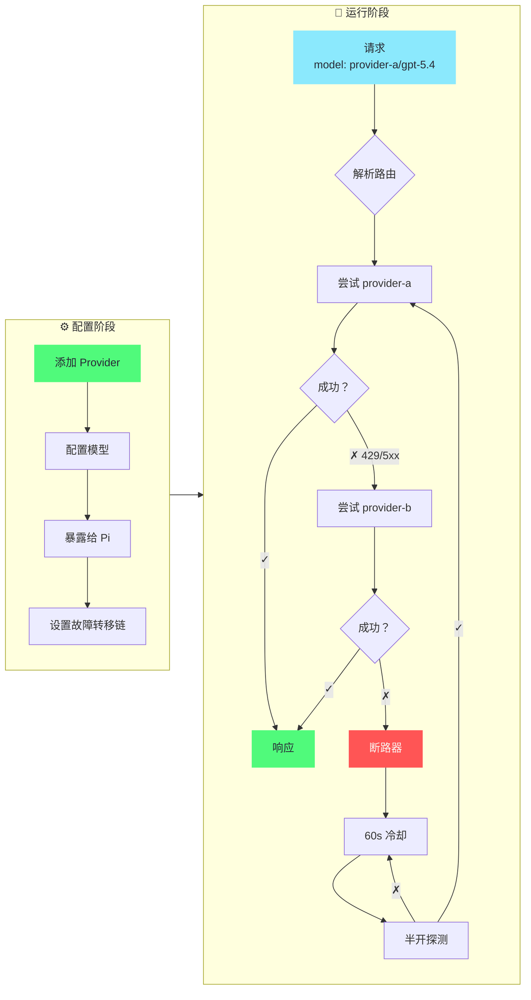

<div align="center">

# pi-switch

[](https://github.com/user/pi-switch/releases)
[](https://github.com/user/pi-switch/releases)
[](https://www.rust-lang.org/)
[](LICENSE)

**TUI + CLI 双模式的 pi agent 配置切换工具**

管理 provider 配置，运行支持按模型名路由的本地网关 — 通过交互式 TUI 或命令行。

[English](README.md) | [中文](#)

</div>

---

## 📸 截图

<div align="center">
  
</div>

---

## 📥 安装

```bash
# npm（推荐）
npm install -g @cokefenta/pi-switch

# 或通过 pi 安装
pi install npm:@cokefenta/pi-switch
```

**从源码构建**（需要 Node.js >= 20, Rust 1.80+）：

```bash
git clone https://github.com/user/pi-switch.git
cd pi-switch
npm install
npm run build:native
node bin/pi-switch.js tui
```

### 系统兼容性

**支持的平台：**
- ✅ Windows (x64)
- ✅ macOS (Intel 与 Apple Silicon)
- ✅ Linux (x64) - glibc 和 musl

**Linux 用户：** 本包包含了 glibc 和 musl 两种预编译二进制文件。如果遇到 GLIBC 版本错误，包会自动回退到兼容性更广的 musl 版本。

**GLIBC 错误排查：**
```bash
# 如果看到 "GLIBC_X.XX not found" 错误，可从源码构建：
npm install -g @cokefenta/pi-switch --build-from-source
```

---

## 🚀 快速开始

```bash
pi-switch tui          # 交互式 TUI（推荐）
pi-switch webui start  # 浏览器界面 http://127.0.0.1:43110
pi-switch doctor       # 运行环境诊断
```

> **三端同源。** CLI、TUI、WebUI 都是同一套 Rust 核心之上的薄适配层。
> WebUI 用法及三端如何保持同步，见 [WEBUI_GUIDE.md](./WEBUI_GUIDE.md)。

### 常用 CLI 命令

```bash
# Provider 管理
pi-switch provider add <名称> [--preset <id>] [--api-key <key>]
pi-switch provider list
pi-switch provider show <名称>
pi-switch provider delete <名称>
pi-switch provider expose <名称> <model-ids...>    # 暴露模型到 pi agent
pi-switch provider fetch-models <名称>             # 从 API 抓取模型列表

# 代理（网关）
pi-switch proxy failover <p1,p2,...>               # 同模型故障转移链
pi-switch proxy start --daemon                     # 启动代理守护进程
pi-switch proxy status

# WebUI（浏览器配置）
pi-switch webui start [--host <ip>] [--port <端口>] [--daemon]
pi-switch webui status
pi-switch webui stop

# 其他
pi-switch presets list                             # 列出内置预设
pi-switch config show                               # 显示当前配置
pi-switch config backups                            # 列出备份文件
pi-switch config export <密码>                      # 加密导出
pi-switch config import <路径> <密码>                # 加密导入
pi-switch stats                                     # 查看请求统计
```

---

## ✨ 功能特性

| 分类 | 亮点 |
|------|------|
| 🔌 **Provider 管理** | 增删改查、复制、搜索/过滤、模型管理、暴露到 pi agent |
| 💡 **内置预设** | OpenRouter、Anthropic、DeepSeek、SiliconFlow、OpenAI — 一键创建配置 |
| 🌉 **模型名网关** | 无状态按 `profile/model` 路由、SSE 流式、User-Agent 伪装、请求体过滤、OpenAI ↔ Anthropic 转换、故障转移、断路器 |
| 🖥️ **交互式 TUI** | ratatui 驱动、Dracula 主题、鼠标支持、vim 键位 (`hjkl`) |
| 🌐 **双语支持** | English / 中文，持久化到配置，Settings 中切换 |
| 📊 **使用统计** | 按 provider、按模型的请求指标与延迟 |
| 💾 **备份与同步** | 每次修改自动备份、AES-256-CBC 加密导出/导入 |
| 🩺 **诊断工具** | `doctor` 命令检查配置、models.json、结构完整性 |

---

## 🎯 核心流程

### 网关路由与故障转移



### 操作步骤

**1. 添加 provider**（CLI 或 TUI）
```bash
pi-switch provider add provider-a --api openai-completions --base-url https://api.example.com/v1 \
    --api-key '$API_KEY' --models gpt-5.4,claude-sonnet-4-5
```
TUI 中：`Profiles → a → 填写表单 → Ctrl+S`

**2. 暴露模型到 pi agent** — 选择哪些模型出现在 `~/.pi/agent/models.json` 中
```bash
pi-switch provider expose provider-a gpt-5.4
```
TUI 中：`Profiles → 选择 provider → x`

**3. 启动代理** — 自动写入一个 `pi-switch` 网关 provider 到 pi
```bash
pi-switch proxy failover provider-b,provider-c          # 可选：同模型故障转移
pi-switch proxy start --daemon
```

**4. 在 pi 中使用** — 选择 `pi-switch` provider，然后选 `provider-a/gpt-5.4` 这样的模型

### 网关路由原理

请求按 body 中的模型名路由 — 无需额外状态，没有"当前目标"概念：

- **模型名路由** — `"model": "provider-a/gpt-5.4"` 解析为 profile `provider-a`、真实模型 `gpt-5.4`；转发前代理将 body.model 改回真实 ID
- **单个网关 provider** — pi 只看到一个 `pi-switch` provider，下面列出所有暴露模型（格式 `profile/真实模型ID`）；在 pi 中切换模型 = 发送不同的 model 字符串 = 即时路由切换
- **自动故障转移** — 429/5xx 或网络错误时，按配置链进行同模型 fallback
- **断路器保护** — 连续 3 次失败后进入 60s 冷却，半开探测成功后自动恢复
- **流式（SSE）** — 同格式请求（openai→openai、anthropic→anthropic）逐字流式转发；保留上游响应头（Content-Type 等）
- **OpenAI ↔ Anthropic** — 自动在 chat completions 和 messages API 间转换
- **User-Agent 伪装** — 内置 Claude Code / Codex / Gemini 预设，发送对应客户端的真实 User-Agent（及 `anthropic-beta` 等头）以通过上游客户端校验；支持全局或按 profile 设置

> **已知限制** — OpenAI ↔ Anthropic **转换**路径无法流式：它需要解析完整 JSON 来转换格式。如果 pi 发 `stream: true` 但模型路由到跨格式上游（OpenAI 请求 → Anthropic 上游，或反之），响应会以单次非流式返回。同格式路由正常流式。

---

## 🏗️ 架构

```
pi-switch/
├── bin/pi-switch.js         # CLI 入口
├── index.js                 # ESM 包装器，用于原生插件
├── pi-switch-native.cjs     # NAPI 加载器（自动平台检测）
├── src-rust/                # Rust 原生核心（napi-rs）
│   ├── lib.rs               # NAPI 函数导出
│   ├── config.rs            # 配置加载/保存、类型
│   ├── ops.rs               # 核心操作
│   ├── presets.rs           # 内置 provider 预设
│   ├── proxy.rs             # 代理服务器（网关路由、故障转移、断路器）
│   ├── daemon.rs            # 守护进程管理
│   ├── stats.rs             # 请求日志聚合
│   ├── sync.rs              # 加密导出/导入
│   └── tui/                 # 交互式终端 UI（ratatui）
│       ├── app.rs           # 状态机 + 按键处理
│       ├── form.rs          # Provider 表单
│       ├── i18n.rs          # 双语（EN/ZH）
│       └── ui/              # 渲染（chrome, pages, overlays）
├── src/                     # JavaScript 层（pi 扩展支持）
├── extensions/index.ts      # Pi agent 扩展（/piswitch）
└── Cargo.toml
```

**配置文件：**
- `~/.pi-switch/config.json` — profiles、代理设置、故障转移链
- `~/.pi-switch/backups/` — 每次修改自动生成带时间戳的备份
- `~/.pi/agent/models.json` — pi 的 provider 注册表（pi-switch 写入单个网关 provider）

---

## ❓ 常见问题

<details>
<summary><b>如何在 pi 中切换模型？</b></summary>
<br>

在 pi 中打开 `/model`，选择任意 `profile/model`（如 `provider-a/gpt-5.4`）。代理按每个请求的模型名路由 — 无需额外操作。

要添加更多模型，在 TUI 中暴露（`Profiles → 选择 provider → x`）或使用 CLI：
```bash
pi-switch provider expose <名称> <model-id>...
```

</details>

<details>
<summary><b>如何设置故障转移？</b></summary>
<br>

TUI 中：`Settings → Failover` → `Enter` → 输入逗号分隔的名称 → `Enter`。
或使用 CLI：
```bash
pi-switch proxy failover provider-b,provider-c
```

暴露了相同模型的 failover 链中的 provider 会在主 provider 失败时按顺序尝试。

</details>

<details>
<summary><b>[proxy] 徽章是什么意思？</b></summary>

<br>

`[proxy]` 徽章表示该 profile 是一个元 profile（`"proxy": true`），用于在 pi 中注册指向本地网关的 provider，不参与上游路由。

在当前的网关模式下，通常不需要 proxy profile — 代理启动时自动向 pi 的 models.json 写入一个 `pi-switch` 网关 provider。

</details>

<details>
<summary><b>网关路由如何工作？</b></summary>

<br>

代理在一个 `pi-switch` provider 下以 `profile/真实模型ID` 格式列出所有暴露模型。当 pi 发送 `"model": "provider-a/gpt-5.4"` 的请求时：

1. 按第一个 `/` 拆分 — profile `provider-a`，真实模型 `gpt-5.4`
2. 路由到 `provider-a` profile 的上游，将 `body.model` 改为 `gpt-5.4`
3. 失败（429/5xx）时，在 failover 链中寻找其他暴露了 `gpt-5.4` 的 profile

```bash
# 1. 暴露模型（按 profile）
pi-switch provider expose provider-a gpt-5.4
pi-switch provider expose provider-b gpt-5.4

# 2. 设置故障转移链（可选）
pi-switch proxy failover provider-b

# 3. 启动代理守护进程
pi-switch proxy start --daemon
```

在 pi 中选择 `pi-switch` provider，然后选 `provider-a/gpt-5.4`。每个请求的模型名决定路由 — 不需要管理"target"。

</details>

<details>
<summary><b>User-Agent 伪装如何工作？</b></summary>
<br>

有些上游渠道只接受白名单内的客户端（校验 User-Agent 名称前缀）。pi-switch 内置三个预设，发送对应客户端的真实身份：

| 预设 | User-Agent | 额外头 |
|------|------------|--------|
| Claude Code | `claude-cli/2.1.161 (external, cli)` | `anthropic-version`、`anthropic-beta` |
| Codex | `codex_cli_rs/0.1.0` | — |
| Gemini | `gemini-cli/0.1.5` | `x-goog-api-client` |

- **全局**：`Settings → User-Agent`，用 `←/→` 切换。
- **按 profile**：在 profile 详情页按 `u` 循环切换；profile 级的值会覆盖全局。适合只有部分上游有 UA 白名单的情况。

注意：这只能通过"看客户端名称"的校验，不会伪造更深的请求级令牌（turn state、session id 等）——严格的一方端点会校验这些。

</details>

<details>
<summary><b>我的数据存储在哪里？</b></summary>
<br>

所有数据在 `~/.pi-switch/` 下。pi 的注册表是 `~/.pi/agent/models.json`。数据不会离开你的设备。

</details>

---

## 🛠️ 开发

```bash
npm run build:native:debug     # 构建 Rust 扩展（debug）
npm run build:native           # 构建 Rust 扩展（release）
cargo build                    # 仅 Rust 构建
cargo clippy                   # Lint
cargo fmt                      # 格式化
cargo test --release --lib     # 运行单元测试
```

**注意：** 在 Windows 上执行 `npm run build:native` 前请停掉 TUI/daemon，避免文件锁定错误。

---

## 🙏 致谢

- **[cc-switch](https://github.com/farion1231/cc-switch)** — Claude Code 的原版 TUI 配置切换工具，开创了交互式终端界面和代理故障转移的设计模式
- **[cc-switch-cli](https://github.com/SaladDay/cc-switch-cli)** — CLI 版本，提供了简洁的命令行 provider 管理接口

也感谢 **[LINUX DO](https://linux.do/)** 社区的讨论催生了这个项目。

---

## 📜 许可证

MIT
