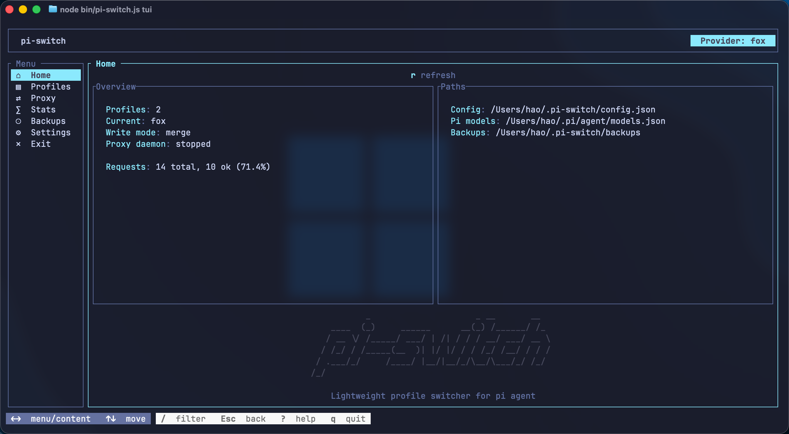
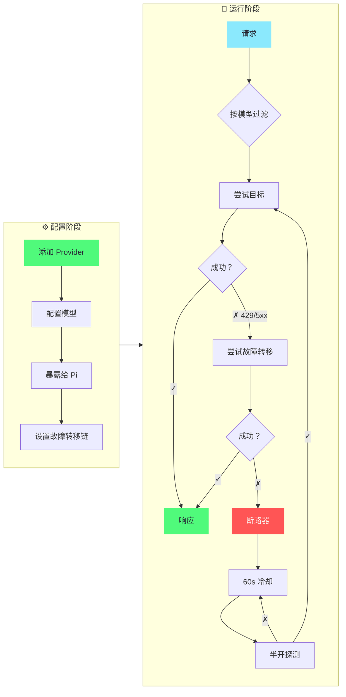

<div align="center">

# pi-switch

[](https://github.com/user/pi-switch/releases)
[](https://github.com/user/pi-switch/releases)
[](https://www.rust-lang.org/)
[](LICENSE)

**TUI + CLI 双模式的 pi agent 配置切换工具**

管理 provider 配置、切换 models.json、运行支持故障转移的本地代理 — 通过交互式 TUI 或命令行。

[English](README.md) | [中文](#)

</div>

---

## 📸 截图

<div align="center">
  
</div>

---

## 📥 安装

```bash
# npm（推荐）
npm install -g @cokefenta/pi-switch

# 或通过 pi 安装
pi install npm:@cokefenta/pi-switch
```

**从源码构建**（需要 Node.js >= 20, Rust 1.80+）：

```bash
git clone https://github.com/user/pi-switch.git
cd pi-switch
npm install
npm run build:native
node bin/pi-switch.js tui
```

---

## 🚀 快速开始

```bash
pi-switch tui          # 交互式 TUI（推荐）
pi-switch doctor       # 运行环境诊断
```

### 常用 CLI 命令

```bash
# Provider 管理
pi-switch provider add <名称> [--preset <id>] [--api-key <key>]
pi-switch provider list
pi-switch provider show <名称>
pi-switch provider delete <名称>
pi-switch provider expose <名称> <model-ids...>    # 暴露模型到 pi agent
pi-switch provider fetch-models <名称>             # 从 API 抓取模型列表

# 代理
pi-switch proxy target <名称>                      # 设置代理目标
pi-switch proxy failover <p1,p2,...>               # 设置故障转移链
pi-switch proxy start --daemon                     # 启动代理守护进程
pi-switch proxy status

# 其他
pi-switch presets list                             # 列出内置预设
pi-switch config show                               # 显示当前配置
pi-switch config backups                            # 列出备份文件
pi-switch config export <密码>                      # 加密导出
pi-switch config import <路径> <密码>                # 加密导入
pi-switch stats                                     # 查看请求统计
```

---

## ✨ 功能特性

| 分类 | 亮点 |
|------|------|
| 🔌 **Provider 管理** | 增删改查、复制、搜索/过滤、模型管理、暴露到 pi agent |
| 💡 **内置预设** | OpenRouter、Anthropic、DeepSeek、SiliconFlow、OpenAI — 一键创建配置 |
| 🌉 **本地代理** | OpenAI 兼容、透明路由、Anthropic 自动转换、故障转移、断路器 |
| 🖥️ **交互式 TUI** | ratatui 驱动、Dracula 主题、鼠标支持、vim 键位 (`hjkl`) |
| 🌐 **双语支持** | English / 中文，持久化到配置，Settings 中切换 |
| 📊 **使用统计** | 按 provider、按模型的请求指标与延迟 |
| 💾 **备份与同步** | 每次修改自动备份、AES-256-CBC 加密导出/导入 |
| 🩺 **诊断工具** | `doctor` 命令检查配置、models.json、结构完整性 |

---

## 🎯 核心流程

### Provider 管理与智能故障转移



### 操作步骤

**1. 添加 provider**（CLI 或 TUI）  
```bash
pi-switch provider add relay-a --api openai --base-url https://relay.example.com/v1 \
    --api-key '$API_KEY' --models deepseek-v4-pro,deepseek-chat
```
TUI 中：`Profiles → a → 填写表单 → Ctrl+S`

**2. 暴露模型到 pi agent** — 选择哪些模型出现在 `~/.pi/agent/models.json` 中  
```bash
pi-switch provider expose relay-a deepseek-v4-pro
```
TUI 中：`Profiles → 选择 provider → x`

**3. 配置代理故障转移** — 定义主目标 + 备用链  
```bash
pi-switch proxy target deepseek-official
pi-switch proxy failover relay-a,relay-b
pi-switch proxy start --daemon
```

**4. 在 pi 中使用** — 通过代理路由的模型会出现在 pi 的 `/model` 中

### 故障转移原理

请求根据模型可用性智能路由：
- **智能路由** — 只尝试支持请求模型的 provider
- **自动故障转移** — 遇到 429/5xx 或网络错误时无缝切换
- **断路器保护** — 连续 3 次失败后进入 60s 冷却，半开探测成功后自动恢复
- **模型隔离** — `exposedModels` 保持 pi 配置简洁，`models` 启用完整故障转移

---

## 🏗️ 架构

```
pi-switch/
├── bin/pi-switch.js         # CLI 入口
├── index.js                 # ESM 包装器，用于原生插件
├── pi-switch-native.cjs     # NAPI 加载器（自动平台检测）
├── src-rust/                # Rust 原生核心（napi-rs）
│   ├── lib.rs               # NAPI 函数导出
│   ├── config.rs            # 配置加载/保存、类型
│   ├── ops.rs               # 核心操作
│   ├── presets.rs           # 内置 provider 预设
│   ├── proxy.rs             # 代理服务器（故障转移、断路器）
│   ├── daemon.rs            # 守护进程管理
│   ├── stats.rs             # 请求日志聚合
│   ├── sync.rs              # 加密导出/导入
│   └── tui/                 # 交互式终端 UI（ratatui）
│       ├── app.rs           # 状态机 + 按键处理
│       ├── form.rs          # Provider 表单
│       ├── i18n.rs          # 双语（EN/ZH）
│       └── ui/              # 渲染（chrome, pages, overlays）
├── src/                     # JavaScript 层
│   ├── commands.js          # CLI 命令
│   ├── proxy.js             # JS 代理服务器
│   └── tui.js               # JS TUI 包装器
├── extensions/index.ts      # Pi agent 扩展（/piswitch）
└── Cargo.toml
```

**配置文件：**
- `~/.pi-switch/config.json` — profiles、代理设置、当前选择
- `~/.pi-switch/backups/` — 每次修改自动生成带时间戳的备份
- `~/.pi/agent/models.json` — pi 的 provider 注册表（由 pi-switch 写入）

---

## ❓ 常见问题

<details>
<summary><b>如何切换 pi 到不同的 provider？</b></summary>
<br>

```bash
pi-switch use <名称>
```
或在 TUI 中：导航到 Profiles，在任意配置上按 `Space`。

</details>

<details>
<summary><b>如何设置故障转移？</b></summary>
<br>

TUI 中：`Settings → Failover chain → Enter` → 输入逗号分隔的名称 → `Enter`。
或直接编辑 `~/.pi-switch/config.json` 的 `settings.proxy.failover`。

</details>

<details>
<summary><b>[proxy] 徽章是什么意思？</b></summary>
<br>

该配置带有 `"proxy": true` — 通过本地代理路由，代理可自动转换 OpenAI/Anthropic 格式并应用故障转移/断路器策略。

</details>

<details>
<summary><b>我的数据存储在哪里？</b></summary>
<br>

所有数据在 `~/.pi-switch/` 下。pi 的注册表是 `~/.pi/agent/models.json`。数据不会离开你的设备。

</details>

---

## 🛠️ 开发

```bash
npm run build:native:debug     # 构建 Rust 扩展（debug）
npm run build:native           # 构建 Rust 扩展（release）
cargo build                    # 仅 Rust 构建
cargo clippy                   # Lint
cargo fmt                      # 格式化
```

---

## 📜 许可证

MIT
